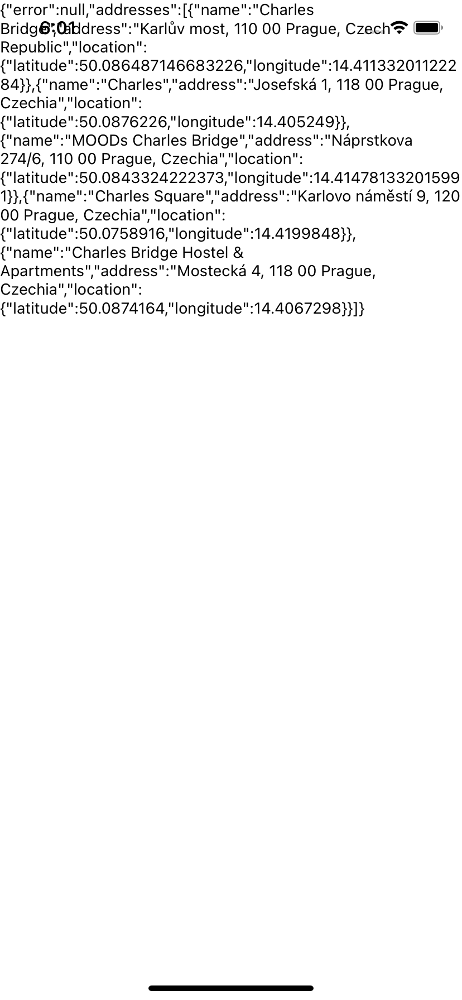

# Example repo for @kiwicom/react-native-reverse-geocode package

To recreate:

1. Run the following commands:
```
$ npx expo init --yarn
$ yarn add @kiwicom/react-native-reverse-geocode
```

2. modify `App.js` with

```js
import * as React from 'react';
import { Text, View, NativeModules } from 'react-native';

const { RNReverseGeocode } = NativeModules;

const region = {
  latitude: 50,
  longitude: 14,
  latitudeDelta: 0.01,
  longitudeDelta: 0.01,
};

const searchText = 'Charles';
var jsonData;

const app = () => {
  const [jsonData, setJsonData] = React.useState(null);
  React.useEffect(() => {
    RNReverseGeocode.searchForLocations(
    searchText,
    region,
    (err, res) => {
      setJsonData({
        error: err,
        addresses: res
      })
    }
  );
  }, [])
  return (
    <View>
      <Text>{JSON.stringify(jsonData)}</Text>
    </View>
  );
};

export default app;
```

3. Follow the instructions to install `@kiwicom/react-native-reverse-geocode`, i.e.:

- on iOS, install the pods
  ```sh
  $ cd ios
  $ pod install
  ```

- on Android, I'm not sure, I haven't tested. The log outputs might give you clues how to solve it.

After running the app with `yarn ios` (and some time compiling the app if it's the first time the command is run), the following view can be seen in the emulator:

